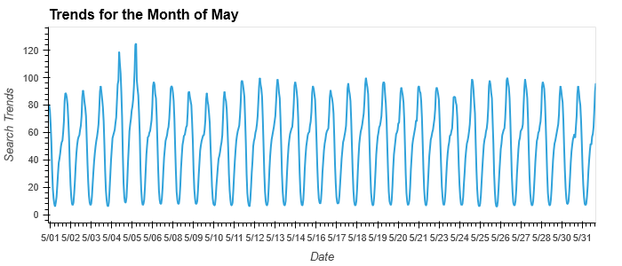
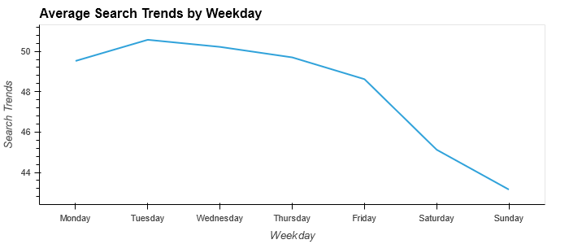
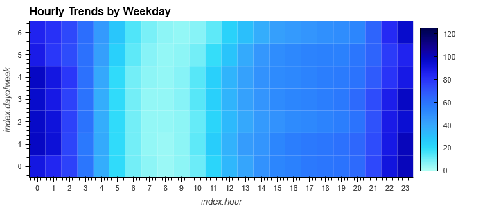
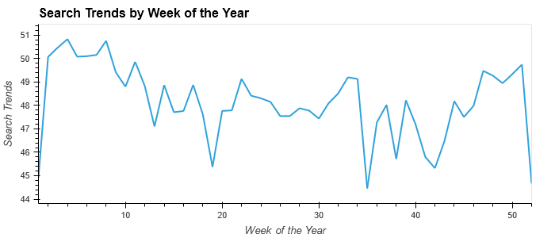
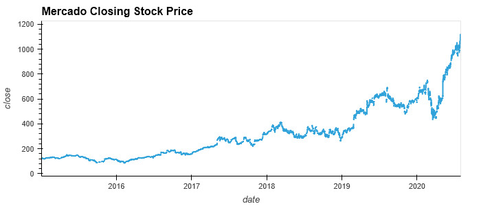
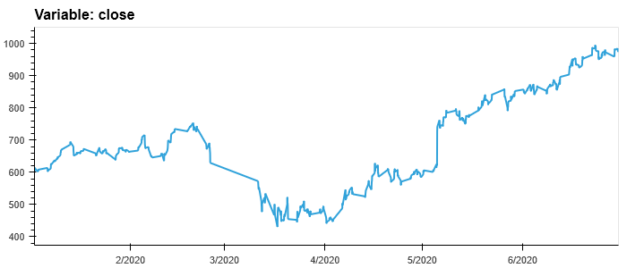
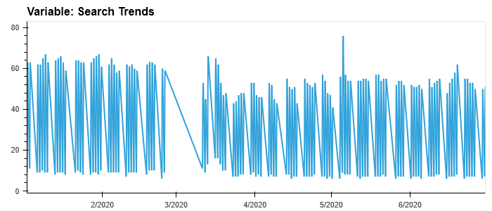
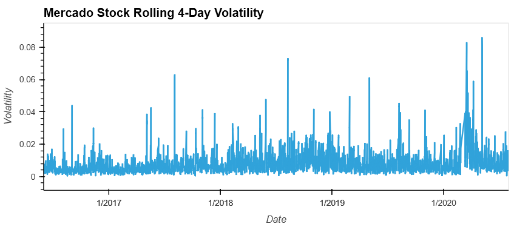
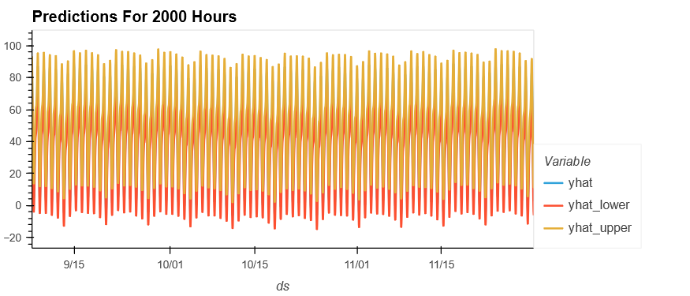
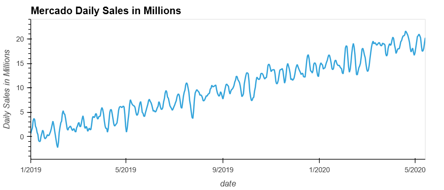

# Time Series Forecasting
* For this assignment I began with importing the necessary libraries, and then the search trends data.
---
## Patterns in Search Traffic
* I began by plotting the month of May 2020 since this is the month Mercado released it's quarterly financial results, to see if there was any spike in search trends around this time. There wasn't much variation other than a small spike on 05/05/2020. 

* Next I looked at the sum of May trends comparative to the overall monthly median, and saw a small positive change (+8.55%). 
---
## Mining for Seasonality
* Here I began by looking at the average by day of the week. This shows that searches are higher on weekdays, and less on the weekends, with the highest day being Tuesdays. 
 
* Next I plotted a heatmap of the hour of day comprative to the day of the week. The lightest, or least frequent times seem to be between 5AM and 11AM.The darkest, or most frequent search times are late at night, around 12AM. 

* Last I looked at the search trends by week of the year. It appears that the search trends go up from week 42 until week 51, then drops very low the last week, between Christmas and New Year.

---
## Relate Search Traffic to Stock Prices
* I began be reading in the stock data close prices and plotting it. 
 
* Next I plotted the data for just the first half of 2020. This time frame shows a hault in search trends right around March 2020, the beginning of the COVID epidemic. There is also a corresponding drop in close prices during the March 2020 time frame. The narrative is that after the initial shock to global financial markets, new customers and revenue increased for e-commerce platforms. Close prices do seem to support this narrative, since after the initial fallout of COVID, the prices began to rise again.  

The search trends had a brief surge right after the COVID timeframe and once again on 05/05/2020. Otherwise they are pretty consistent. 

* Next I looked at the rolling 4-day volatility of the stock data. 

* Last I analyzed the correlation between the 1-hour lagged Search Trends, Hourly Stock Returns, and Stock Volatility. There is not a high correlation between lagged search trends and either stock volatility or hourly stock return. The highest correlation is between lagged search trends and stock volatility, but it is still only 14.8% correlated. Lagged search trends and hourly stock return are only correlated at 0.018, or 1.8%. 
---
## Prophet Time Series Model Search Trends
* Here I began with copying the search trends data and formatting it to fit the prophet model. 
* Next I fit the model and predicted the search trends for the next 2000 hours, about 80 days, of search trends.  

---
## Prophet Time Series Model Daily Sales
* For this section I imported the Mercado daily revenue data. I then plotted the data visually. 

* I then fit the model to the historical daily sales data, and predicted for 90 days ahead, the next quarter, from the last date of available data.  
* Based on the prophet model predictions, the next quarter should see about 1.9 billion dollars in sales. The lower end of that prediction being 1.7 billion dollars and the upper range being 2.1 billion dollars in sales. 